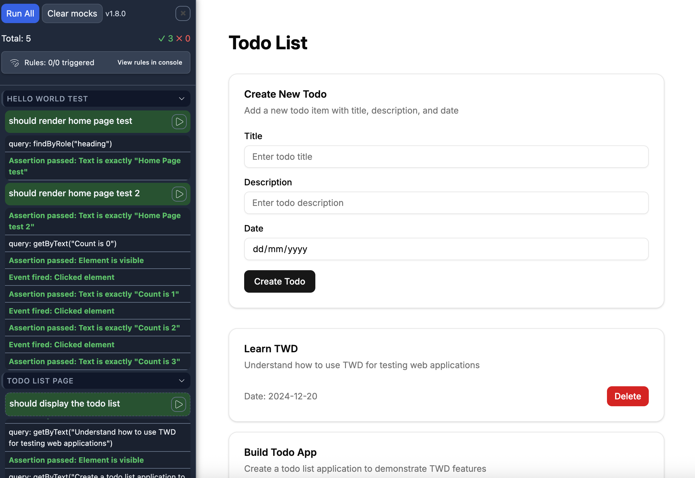

# twd-react-router

A showcase of testing **React Router v7** (SSR framework mode) **in the browser, while you build**, with [TWD](https://github.com/BRIKEV/twd-js).



The sidebar on the left is TWD running real assertions against the app on the right. No jsdom, no Vitest workers, no extra renderer — just the dev server and an in-browser test panel.

---

## What this project demonstrates

| React Router 7 feature | Where it lives | What it does |
|---|---|---|
| **SSR framework mode** | `react-router.config.ts` | `ssr: true` — server renders the initial HTML, then hydrates |
| **File-based routes** | `app/routes/*` + `app/routes.ts` | `/`, `/todos`, `/testing` |
| **Loaders & actions** | `app/routes/todolist.tsx` | `loader` returns the todo list; `action` handles create + delete against json-server |
| **Forms** | `app/routes/todolist.tsx` | `react-hook-form` + React Router `<Form>` for create-todo |
| **Test isolation** | `app/twd-tests/*` | `createRoutesStub` mounts a single route with stubbed loaders/actions inside the harness page |

The rest of the stack:

- **Vite** dev server on `:5173`, REST API proxied to **json-server** on `:3001` (`data/data.json`).
- **Tailwind v4** + shadcn-style components (Radix primitives in `app/components/ui`).
- **TWD** (`twd-js` + `twd-relay`) for in-browser tests, **twd-cli** for headless CI runs.
- **vite-plugin-istanbul** + **nyc** for coverage.

---

## Getting started

```bash
npm install
npm run serve:dev   # json-server on :3001 + Vite dev on :5173
```

Open <http://localhost:5173>. The TWD sidebar opens with the app — hit **Run All** to run the tests in `app/twd-tests/`.

---

## Setting up TWD in React Router v7

React Router v7 in SSR framework mode is **not a Vite-served SPA**. There's no `index.html` at the project root — the framework's own dev middleware SSRs `app/root.tsx` to produce HTML. That has one consequence that matters for TWD:

**The `twd()` and `twdRemote()` Vite plugins inject their bootstrap scripts via Vite's `transformIndexHtml` hook**, and that hook never fires for SSR-framework HTML. Plugin auto-injection silently no-ops — no sidebar, no relay.

The fix is one block in `app/root.tsx`, dev-only:

```tsx
// app/root.tsx — inside <Layout>'s <head>
{import.meta.env.DEV && (
  <>
    <script type="module" src="/@id/virtual:twd/init" />
    <script type="module" src="/@id/virtual:twd-relay/connect" />
  </>
)}
```

The plugins still register the virtual modules and Vite still serves them at `/@id/...` — we just point at them ourselves from the SSR'd root template. The `import.meta.env.DEV` guard keeps the tags out of production.

> The `/@id/...` URLs assume Vite `base` is `/`. If you change `base`, prefix accordingly. The same pattern likely applies to any SSR framework that doesn't pipe through `transformIndexHtml` (SvelteKit, Nuxt, …).

The rest of the wiring is standard:

```ts
// vite.config.ts
import { twd } from 'twd-js/vite-plugin'
import { twdRemote } from 'twd-relay/vite'

export default defineConfig({
  plugins: [
    // …reactRouter(), tailwindcss(), tsconfigPaths(), istanbul()…
    twd({ testFilePattern: '/**/*.twd.test.{ts,tsx}', serviceWorker: false }),
    twdRemote() as PluginOption,
  ],
  server: {
    warmup: {
      clientFiles: [
        './app/twd-tests/**/*.twd.test.{ts,tsx}',
        './app/root.tsx',
      ],
    },
  },
  optimizeDeps: {
    include: ['twd-js/bundled', 'twd-relay/browser'],
  },
})
```

The `server.warmup` and `optimizeDeps` blocks aren't cosmetic — they're a second SSR-mode workaround. The injected `<script>` tags above point at virtual modules. Vite's dep scanner doesn't walk virtual modules, so it discovers their transitive deps lazily on the first browser request, optimizes them, and triggers an auto-reload to serve the optimized bundle.

Locally it's a quick auto-refresh you barely notice. In headless CI (twd-cli + Puppeteer with a 10s timeout) it's a hard failure: `waitForSelector('#twd-sidebar-root')` times out because the bootstrap restarts mid-load and never finishes inside the window. `server.warmup.clientFiles` makes Vite walk those files' import graphs at startup. `optimizeDeps.include` explicitly pre-bundles the two entries the virtual modules pull in. With both in place, no first-request optimization happens, no reload fires, and the sidebar mounts on first hit locally and in CI.

---

## The `testing-page` + `createRoutesStub` pattern

React Router 7 route components consume `useLoaderData`, `useParams`, `useMatches` — they can't be rendered outside a router context. And you don't want to run the **real** router for component tests either: that pulls in the real loaders, real actions, real network. Those belong in their own backend tests.

This project splits the two cleanly:

- **The harness page** (`app/routes/testing-page.tsx`) is an otherwise-empty route exposing a `<div data-testid="testing-page">` container.
- **`setupReactRoot()`** (`app/twd-tests/utils.ts`) navigates to `/testing`, finds the container, and gives the test a fresh `createRoot`. Called from `beforeEach`.
- **`createRoutesStub`** from `react-router` builds a tiny in-memory router with **only** the route under test, plus a stubbed `loader` and `action`.

```tsx
// app/twd-tests/todoList.twd.test.tsx (abridged)
import { twd, expect, userEvent, screenDom } from 'twd-js'
import { describe, it, beforeEach } from 'twd-js/runner'
import { createRoutesStub, useLoaderData, useParams, useMatches } from 'react-router'
import { createRoot } from 'react-dom/client'

import TodoListPage from '~/routes/todolist'
import todoListMock from './mocks/todoList.json'
import { setupReactRoot } from './utils'

describe('Todo List Page', () => {
  let root: ReturnType<typeof createRoot> | undefined

  beforeEach(async () => {
    root = await setupReactRoot()
  })

  it('renders todos from the loader', async () => {
    const Stub = createRoutesStub([
      {
        path: '/',
        Component: () => {
          const loaderData = useLoaderData()
          const params = useParams()
          const matches = useMatches() as any
          return <TodoListPage loaderData={loaderData} params={params} matches={matches} />
        },
        loader() {
          return { todos: todoListMock }
        },
      },
    ])

    root!.render(<Stub />)
    await twd.wait(300)

    twd.should(await screenDom.getByText('Learn TWD'), 'be.visible')
    twd.should(await screenDom.getByText('Date: 2024-12-20'), 'be.visible')
  })

  it('submits the create-todo action with the right payload', async () => {
    let actionRequest: Record<string, string> | null = null
    const Stub = createRoutesStub([
      {
        path: '/todos',
        Component: /* same wrapper as above */ () => null,
        loader() { return { todos: [] } },
        async action({ request }) {
          const formData = await request.formData()
          actionRequest = Object.fromEntries(formData) as Record<string, string>
          return null
        },
      },
    ])

    root!.render(<Stub initialEntries={['/todos']} />)
    await userEvent.type(await screenDom.getByLabelText('Title'), 'Test Todo')
    await userEvent.click(await screenDom.getByRole('button', { name: 'Create Todo' }))

    expect(actionRequest).to.deep.equal({ title: 'Test Todo', /* … */ })
  })
})
```

### Frontend tests vs. backend tests

This pattern makes the test boundary explicit:

- **Frontend tests** (these `.twd.test.tsx` files) assert on rendering and on what payload the form/UI produces. They never know that `fetchTodos()` exists — the loader is a stub.
- **Backend tests** (when you write them) exercise the real `loader` and `action` directly — they're plain async functions that return data — and assert on the HTTP calls without ever rendering a component.

Two suites, two responsibilities, no overlap. Each stays small, deterministic, and easy to diagnose when it fails.

See `app/twd-tests/helloWorld.twd.test.tsx` for the minimal version, and `todoList.twd.test.tsx` for loaders, actions, and form submission.

---

## Project layout

```
app/
  api/
    todos.ts             # axios client + types — used by real loaders/actions
  components/
    ui/                  # shadcn / Radix primitives
    TodoItem.tsx
  routes/
    home.tsx             # /
    todolist.tsx         # /todos — loader + action + form
    testing-page.tsx     # /testing — empty mount container for tests
  twd-tests/
    mocks/
      todoList.json
    utils.ts             # setupReactRoot()
    helloWorld.twd.test.tsx
    todoList.twd.test.tsx
  root.tsx               # Layout — includes the dev-only TWD <script> block
  routes.ts              # route table
data/
  data.json              # json-server seed
  routes.json            # json-server route rewrites
twd.config.json          # twd-cli headless config
```

---

## Scripts

| Command | What it does |
|---|---|
| `npm run dev` | Vite dev server on `:5173` (TWD sidebar opens automatically) |
| `npm run serve` | json-server on `:3001` |
| `npm run serve:dev` | Both in parallel |
| `npm run build` | React Router production build |
| `npm run start` | Run the production build (`react-router-serve`) |
| `npm run typecheck` | `react-router typegen && tsc` |
| `npm run collect:coverage:text` | Print coverage to stdout (after a run via `twd-cli`) |
